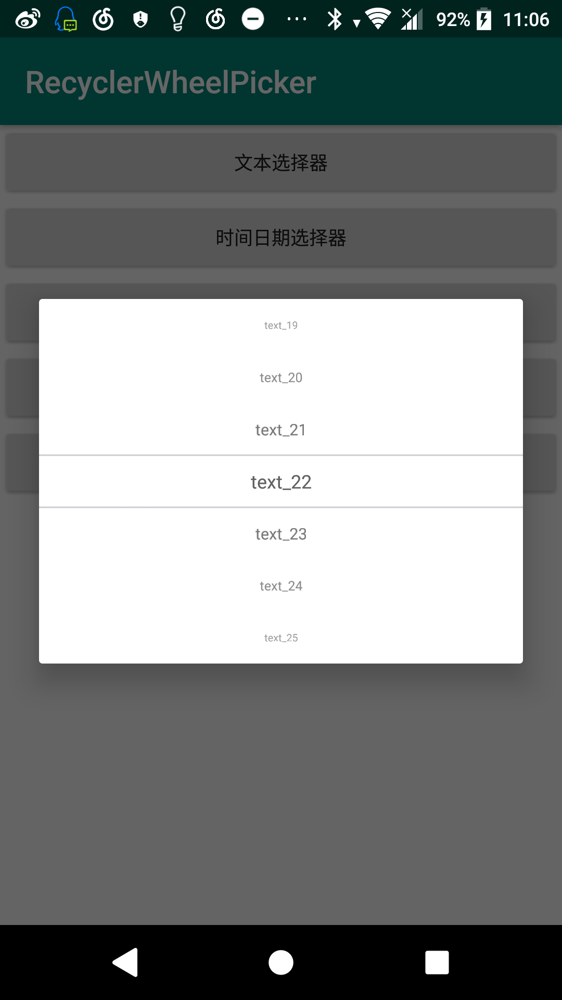

# RecyclerWheelPicker

[](https://jitpack.io/#NingOpenSource/RecyclerWheelPicker)
---
基于recyclerview的滚轮选择器,支持自定义view,自定义滚动特效,自定义滚轮样式,万条数据也不会卡顿,流畅滚动

## 集成
```gradle
	allprojects {
		repositories {
			...
			maven { url 'https://jitpack.io' }
		}
	}
```

androidX:
```gradle
	dependencies {
	        implementation 'com.github.NingOpenSource:RecyclerWheelPicker:1.0.1-support'
	}
```

android-support:
```gradle
	dependencies {
	        implementation 'com.github.NingOpenSource:RecyclerWheelPicker:1.0.1'
	}
```


## 使用例子

[点击此处下载demo](https://github.com/NingOpenSource/RecyclerWheelPicker/blob/android_support/doc/app-debug.apk?raw=true)

***1.0.1版本后新增`LinearLayoutX`和`FrameLayoutX`两个布局用以支持`BottomSheetDialog`和`BottomSheetDialogFragment`，避免出现滑动冲突***
```xml
    <org.yanning.recyclerwheelpicker.extra.LinearLayoutX
        android:layout_width="match_parent"
        android:layout_height="wrap_content">
        <org.yanning.recyclerwheelpicker.RecyclerWheelPicker
            android:layout_width="match_parent"
            android:layout_height="wrap_content"/>
    </org.yanning.recyclerwheelpicker.extra.LinearLayoutX>
```


```java
RecyclerWheelPicker<String> picker = new RecyclerWheelPicker(this);
        picker.setMaxShowSize(7);
        picker.setSelectedAreaHeight(100);
        picker.setAdapter(new TextViewWheelAdapter<String>() {
            @Override
            protected String getWheelItemName(int position, String s) {
                return s;
            }

            @Override
            protected int getPositionByValue(String s) {
                return Integer.valueOf(s.replace("text_", ""));
            }

            @Override
            protected void onWheelSelected(RecyclerView.ViewHolder holder, int position, String s) {
                selected1 = s;
            }

            @Override
            protected String getWheelItemData(int position) {
                return "text_" + position;
            }

            @Override
            protected int getWheelItemCount() {
                return 10000;
            }
        });
        picker.setDefaultValue(selected1);
        new AlertDialog.Builder(this)
                .setView(picker).create().show();

```



